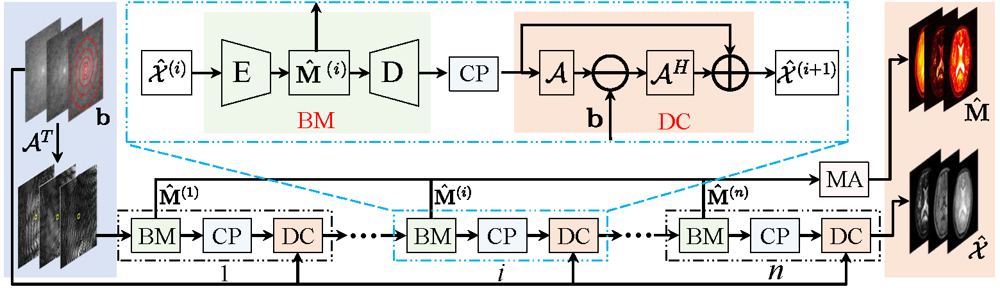

# TLR-BM-MRF
A simple implementation of the TLR-BM-Net for MRF reconstruction: "Learned Tensor Low-CP-Rank and Bloch Response Manifold Priors for Non-Cartesian MRF Reconstruction"


# Files
* 'configs': contains the configuration files
* 'data': contains the data required for the training and testing
* 'dataset': data loader
* 'model': model definition
* 'utils': utility functions
* 'train.py': training script
* 'test.py': testing script
* 'demp.ipynb': demo script
# Data preparation
* Download the data from [here](https://drive.google.com/drive/folders/1aplQaP59_ZDB0vcVo2wkQPTqnght-iAu?usp=sharing)
* put the data in the 'data' folder
* the data folder should look like this:
```bash
data
├── MRF_dataset
│   ├── csm_maps
│   ├── k_samples
│   ├── para_maps
│   ├── X
│   ├── ktraj_nufft.mat
├──output
│   ├── Model_save
│   ├── TLR_BM_X_4_5_2023-04-17-13 (Note: a output data folder for example)
```
# Demo
* complete the "Data preparation" step
* run the 'demo.ipynb' file to see the results
# Training
## prepare your data as the above data structure
* run the following command to train the model
```bash
python train.py
```
* the results will be saved in the 'data/output/TLR_BM_X_4_5_2023-04-17-13/' folder
# Testing
## run the following command to test the model
```bash
python test.py
```
* the results will be saved in the 'data/output/TLR_BM_X_4_5_2023-04-17-13/test/' folder

# Requirements
* [torchkbnufft](https://github.com/mmuckley/torchkbnufft)
* PyTorch >=1.13.0
* numpy
* scipy
* matplotlib


# References
* https://ieeexplore.ieee.org/document/10210402
* @ARTICLE{10210402,
  author={Li, Peng and Hu, Yue},
  journal={IEEE Transactions on Medical Imaging}, 
  title={Learned Tensor Low-CP-Rank and Bloch Response Manifold Priors for Non-Cartesian MRF Reconstruction}, 
  year={2023},
  volume={},
  number={},
  pages={1-1},
  doi={10.1109/TMI.2023.3302872}}
